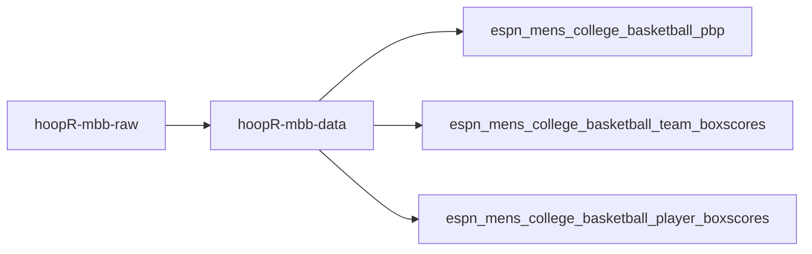
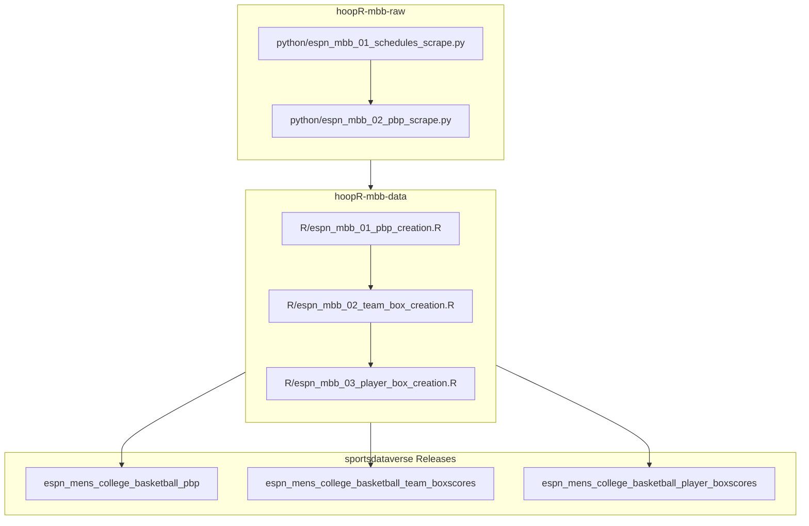

# hoopR-mbb-raw

## hoopR ESPN MBB workflow diagram

Script numbers are run order — `01` writes the season schedule that `02` reads
to enumerate games. `05` (draft) is an intentional hole: the stage numbering is
shared across the nba/mbb/wnba raw repos, and MBB has no draft dataset.

[hoopR-nba-raw data repository (source: ESPN)](https://github.com/sportsdataverse/hoopR-nba-raw)

[hoopR-nba-data repository (source: ESPN)](https://github.com/sportsdataverse/hoopR-nba-data)

[hoopR-nba-stats-data Repo (source: NBA Stats)](https://github.com/sportsdataverse/hoopR-nba-stats-data)

[hoopR-mbb-raw data repository (source: ESPN)](https://github.com/sportsdataverse/hoopR-mbb-raw)

[hoopR-mbb-data repository (source: ESPN)](https://github.com/sportsdataverse/hoopR-mbb-data)

[hoopR-kp-data Repo (source: KenPom)](https://github.com/sportsdataverse/hoopR-kp-data)