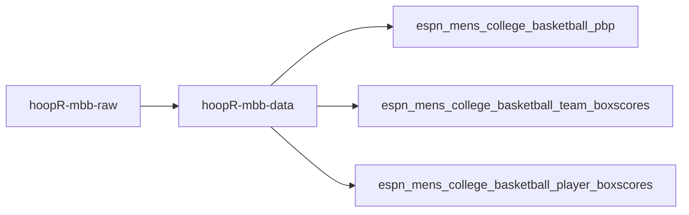
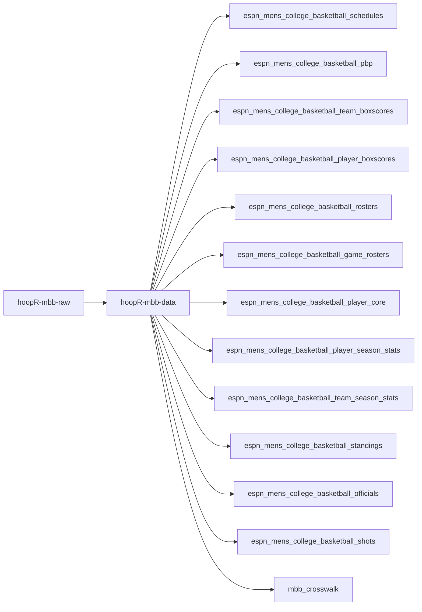
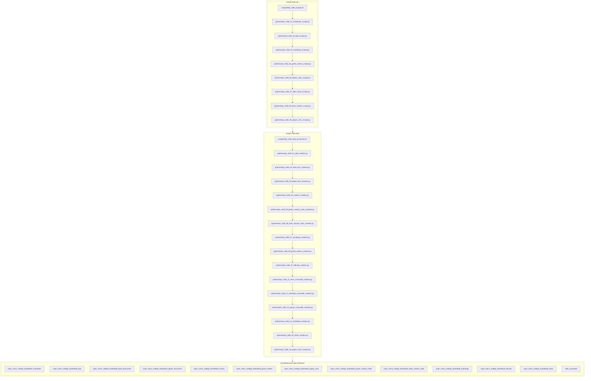

# hoopR-mbb-raw

## hoopR ESPN MBB workflow diagram

`scripts/daily_mbb_scraper.sh` and `scripts/daily_mbb_data_processor.sh` are the
daily drivers (the `00` role); stage numbers are intended build order, not run order.

Stage numbers are stable cross-repo identifiers, so holes are expected —
`05` (draft) is NBA-only and intentionally vacant on the MBB side.

[hoopR-mbb-raw repository (source: ESPN)](https://github.com/sportsdataverse/hoopR-mbb-raw)

[hoopR-mbb-data repository (source: ESPN)](https://github.com/sportsdataverse/hoopR-mbb-data)

[hoopR-nba-raw repository (source: ESPN)](https://github.com/sportsdataverse/hoopR-nba-raw)

[hoopR-nba-data repository (source: ESPN)](https://github.com/sportsdataverse/hoopR-nba-data)

[hoopR-nba-stats-raw repository (source: NBA Stats)](https://github.com/sportsdataverse/hoopR-nba-stats-raw)

[hoopR-nba-stats-data repository (source: NBA Stats)](https://github.com/sportsdataverse/hoopR-nba-stats-data)

[ncaa-mbb-hoops-raw repository (source: stats.ncaa.org)](https://github.com/sportsdataverse/ncaa-mbb-hoops-raw)

[ncaa-mbb-hoops-data repository (source: stats.ncaa.org)](https://github.com/sportsdataverse/ncaa-mbb-hoops-data)

[hoopR-kp-data repository (source: KenPom, dormant)](https://github.com/sportsdataverse/hoopR-kp-data)

## Reports & explainers

<!-- BEGIN GENERATED: reports -->

| Report | What it is | Last updated |
|---|---|---|
| _none yet_ | — | — |

<!-- END GENERATED: reports -->

## Automation & status

<!-- BEGIN GENERATED: status -->

| workflow | schedule | last run |
|---|---|---|
|  | on push / PR / dispatch | 2026-08-19 |
|  | on push / PR / dispatch | 2026-08-19 |
|  | on push / dispatch | 2026-08-19 |

<!-- END GENERATED: status -->
